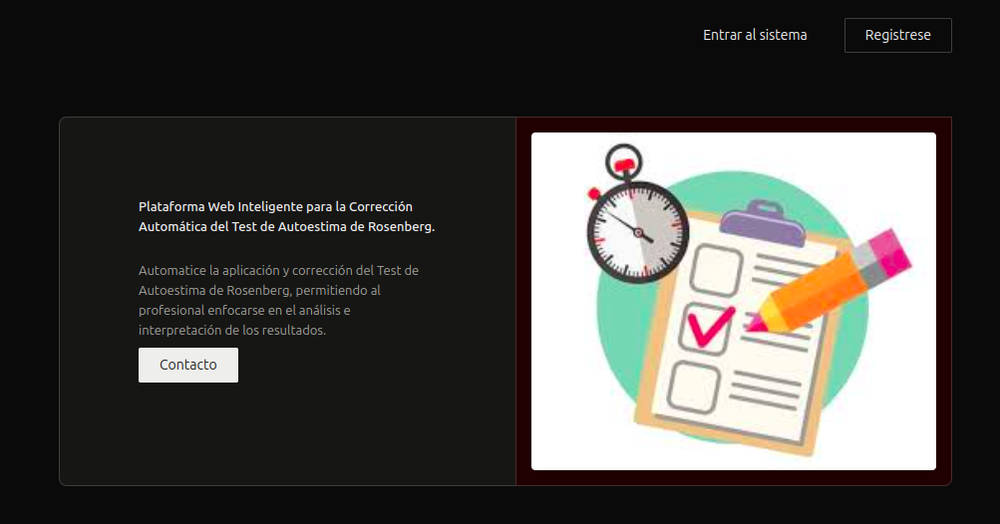
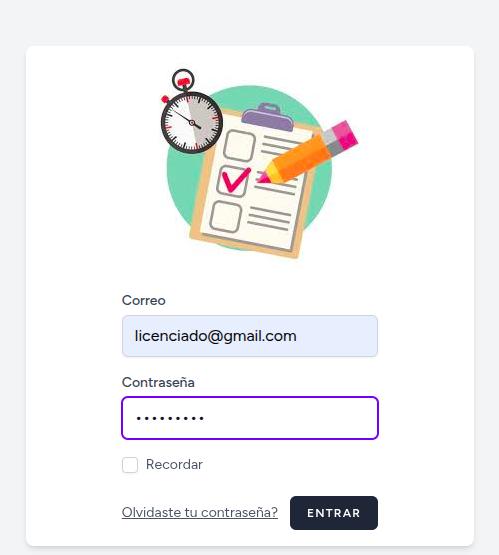
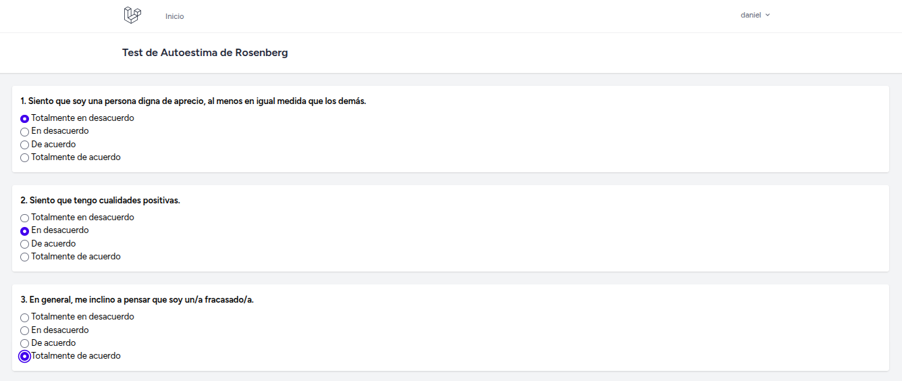
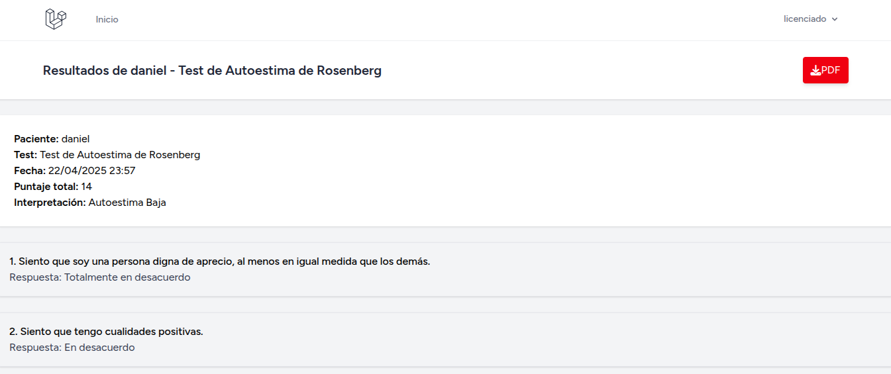
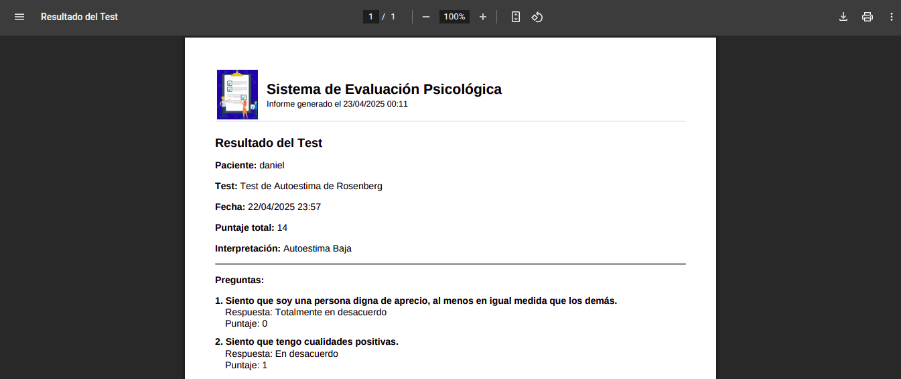
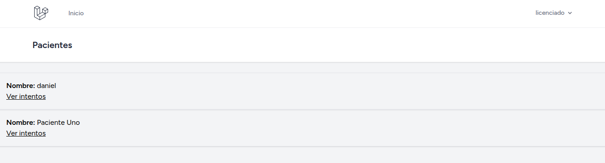

# 🧠 Plataforma Web para Evaluación Psicológica – Proyecto Personal

Este proyecto es una **plataforma web funcional desarrollada con Laravel 11**, orientada a la **aplicación, corrección automática y análisis de test psicológicos**, como el Test de Matrices Progresivas de Raven y el Test de Autoestima de Rosenberg.

📌 Proyecto en desarrollo activo con proyección comercial.  
📌 Este repositorio **no contiene el código fuente** por motivos de confidencialidad.  
📌 Documentación, capturas y características clave a continuación.

---

## 🎯 Objetivo

Crear una herramienta digital intuitiva y segura que permita a profesionales de la salud mental gestionar evaluaciones psicológicas de forma remota, estructurada y automatizada.

---

## ⚙️ Tecnologías utilizadas

- **Framework principal:** Laravel 11 (PHP)
- **Frontend:** Blade, HTML5, CSS3
- **Backend:** PHP 8.3
- **Base de datos:** MySQL
- **Servidor:** Apache en Ubuntu
- **Control de versiones:** Git / GitHub
- **Diseño UX/UI:** Figma (estructura básica), CorelDRAW (gráficos y elementos visuales)

---

## 👥 Roles de usuario

- **Admin:** Vista completa del sistema.
- **Licenciado:** Acceso a pacientes asignados y resultados de evaluaciones.
- **Paciente:** Visualización del test, envío de respuestas y mensaje de cierre.

---

## 🧪 Tests incluidos

- Autoestima de Rosenberg

Cada test se responde en una sola página, con envío automático y registro de resultados en la base de datos. Se genera un informe PDF (versión inicial) para el licenciado.

---

## 📊 Funcionalidades implementadas

- Registro y login de usuarios por tipo
- Aplicación de tests en línea
- Evaluación automática de respuestas
- Almacenamiento y visualización de resultados
- Gestión de relaciones entre licenciado, paciente y test
- Arquitectura escalable para agregar nuevos tests

---

## 🖼️ Capturas de pantalla

### Inicio del Sistema  

### Login por rol  

### Aplicación del test por el paciente  

### Vista de resultados por el licenciado  

### Vista del informe PDF por el licenciado  

### Vista de lista de pacientes por el licenciado  

> *(Las imágenes anteriores son referenciales. No se incluye código fuente en este repositorio.)*

---

## 📌 Estado del proyecto

✔️ Módulo funcional completo con tests activos  
🔧 En desarrollo: conexión con backend en Python para análisis más avanzado  
📈 Próxima etapa: panel de estadísticas y visualización interactiva de resultados  

---

## 📞 Contacto

Para más información o demostración funcional:

**Desarrollador:** Ignacio Daniel Leiva  
📧 ignacioleiva79@gmail.com  
🌐 GitHub: [github.com/ignacioleiva79](https://github.com/ignacioleiva79)

---

## ⚠️ Licencia

Este proyecto está en fase de desarrollo privado y **no es de uso libre ni código abierto**. Las ideas y diseño aquí presentados están protegidos por derechos del autor.

